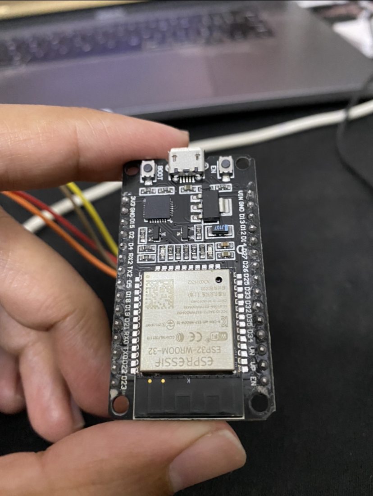
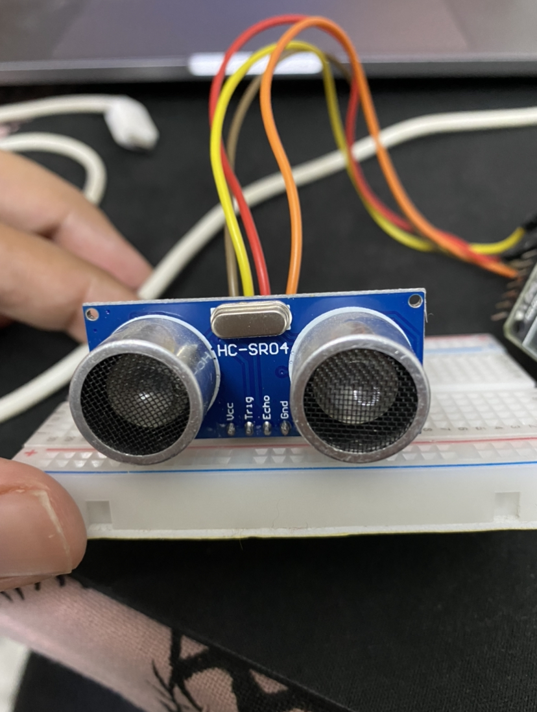
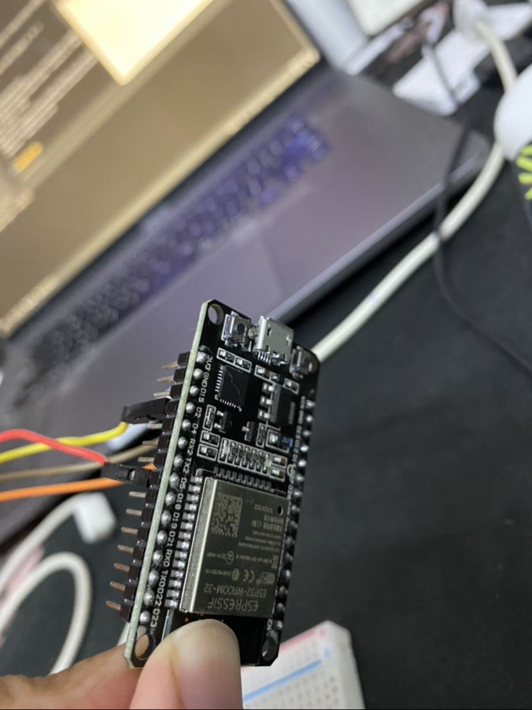
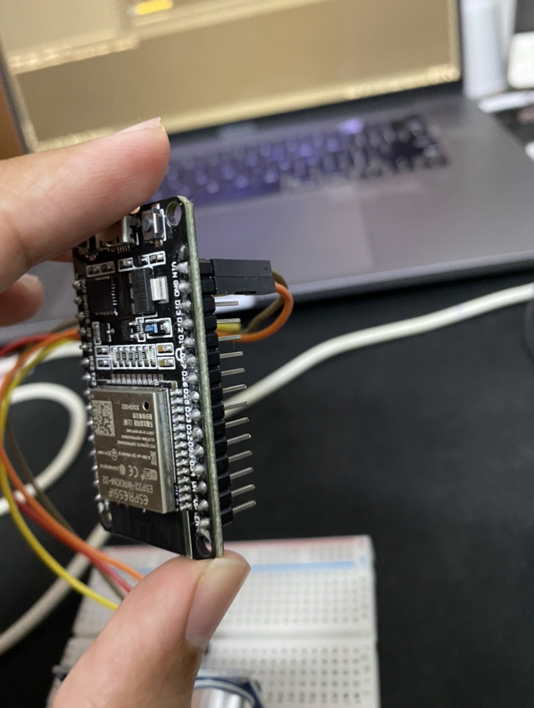

# Home-Security-ESP32
A home security system with sms alert sent on phone in case a intruder is detected.
This system will send a sms alert on the provided phone number if a object comes
as close as 72 cm or less to the ultrasonic sensor. You can change the distance of object
detection according to your requirements in the sketch mentioned below.

## Hardware Requirements

- ESP32 Development Board 2.4GHz Dual Mode WiFi + Bluetooth Dual Cores ESP32s Antenna module board
- HC-SR 04 Ultrasonic Sensor Module
- 400 POINT BREADBOARD
- Jumper Wires(Female to Male)
- USB cable (Please read ESPs power requirements)

I connected my ESP32 board to my laptop using USB cable to power it.

## Software Requirements

- Arduino 1.8.13
- Pycharm

## Buy Hardware

- https://www.amazon.in/gp/product/B079PVCF2G/ref=ppx_yo_dt_b_search_asin_title?ie=UTF8&psc=1
- https://www.tomsonelectronics.com/products/ultrasonic-sensor-hc-sr04
- https://www.tomsonelectronics.com/products/male-to-female-jumper-wires-cables-40-pieces
- https://www.tomsonelectronics.com/products/400-point-breadboard

## Backend Installation

- Clone Home-Security-ESP32
- Go inside Backend directory and open esp in pycharm.
- create a virtual environment
- pip install -r requirements.txt
- Update the .env file in the esp directory where manage.py is located, with 
FAST2SMS authorization key and the phone number where you want to receive the 
alerts.
- Run your web server
    
    python manage.py runserver 0.0.0.0:8000 (to listen on all interfaces)
- For backend I have used default sqlite database.

## ESP32 installation

- Go inside ESP sketch --> alert_system_esp
- open alert_system_esp.ino in Arduino.
- Choose Tools --> Boards --> Board manager - Type `esp32` and install board by 
`Espressif Systems` version `1.0.4`
- Connect ESP with ultrasonic sensor, connections are given below

    CONNECT ultrasonic `VCC` to ESP32 `VIN`

    CONNECT ultrasonic `GND` to ESP32 `GND`

    CONNECT ultrasonic `ECHO` to ESP32 `D5`

    CONNECT ultrasonic `TRIG` to ESP32 `D2`

- Now connect ESP with your laptop using USB to power it up.
- Update the sketch with your wifi ssid and wifi password, and your server's IP,
at the mentioned places.
- Upload the sketch using button on the top left corner of arduino. You might need to press and hold 
the boot button on the ESP32 board while uploading your sketch, if sketch fails
to upload.

## References

- https://medium.com/@prathamanchan22/send-text-message-sms-in-python-using-fast2sms-a1399e863552
- https://randomnerdtutorials.com/esp32-http-get-post-arduino/

